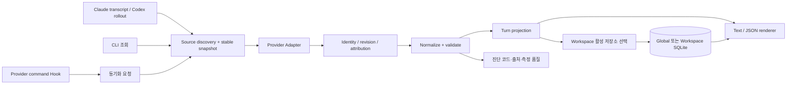

# Architecture — 기술 설계

작성일: 2026-09-19 · 갱신일: 2026-09-20 · 상태: 사용자 결정 반영 완료, Provider 계약 검증 대기

## Architecture Overview

사용자 결정 커밋 `2498359`를 기준으로 로그 중심 수집, C#/.NET Windows CLI, 전역·workspace-local 저장 모두 지원, SQLite, 귀속 가능한 child 포함, 비용 추정 Later, 최소 metadata와 opt-in 확장, 다중 세션 대화형 선택을 반영했다. 사용자 결정 게이트는 해소되었다. Provider 내부 로그의 identity·usage 의미는 TASK-001/004에서 검증해야 하며 제품 지원을 미리 확정하지 않는다.



로그 읽기와 집계는 동일 서비스로 공유한다. 조회는 fresh snapshot 또는 source 부재 시 보관 snapshot을 출력하고, `sync`/Hook은 검증된 결과를 저장한다. 수집된 기록은 append 이벤트 자체가 아닌 logical record의 revision으로 해석한다.

## Technology Stack

| 선택 / 구현 후보 | 이유 | 검증 조건 |
|---|---|---|
| C# + 지원 중인 .NET LTS | Windows CLI 배포, 타입 있는 데이터 모델, SQLite 연동 | UC-002, 구현 시 지원 SDK 버전과 패키지 버전 고정 |
| System.Text.Json | 스트리밍 JSONL 읽기, 제품 runtime 내장 | 한 행 크기·정수 overflow 제한 필요 |
| Microsoft.Data.Sqlite + SQLite | transaction·unique key·upsert로 동시 writer 제어 | UC-004, bundled SQLite 버전과 보안 수정 확인 |
| xUnit 등 단일 테스트 러너 | golden fixture와 프로세스 통합 검증 | 구현 시작 시 유지 중인 버전 선택 |
| Python 표준 라이브러리 | 짧은 조사용 스크립트 후보 | 제품 runtime 추가 의존으로 만들지 않음 |

단일 파일 배포는 OS/architecture별 산출물이 필요하므로 하나의 exe로 모든 OS를 지원한다고 약속하지 않는다. Self-contained win-x64 산출물과 native SQLite 파일 배치/추출을 패키징 테스트로 검증한다. [Microsoft 단일 파일 배포 문서](https://learn.microsoft.com/en-us/dotnet/core/deploying/single-file/overview)

## System Components / Responsibilities

| 구성 요소 | 책임 | 금지 사항 |
|---|---|---|
| CLI | 명령 검증, 선택자, 출력·종료 코드 | 내부 집계 규칙 중복 구현 |
| SessionSelector | 터미널 후보 선택·취소·재검증 | JSON/Hook/CI/파이프에서 입력 대기 |
| StorageRouter / Migrator | workspace별 활성 저장소·migration·중복 탐지 | 두 저장소 동시 write 또는 자동 fallback |
| Discovery | 허용된 source root에서 session/workspace 탐색 | 사용자 홈 전체 파일 내용 스캔 |
| ClaudeAdapter / CodexAdapter | 지원 형식 판별, native usage와 identity 추출 | 누락 필드 자동 0 채우기 |
| IdentityResolver | 재개/fork 중복·revision·실행 주체 구분 | 파일 경로만으로 동일 호출 판단 |
| AttributionResolver | root/child 관계와 귀속 증거 관리 | timestamp만으로 parent 추측 |
| UsageNormalizer | 필드 포함 관계와 불변식 검증 | 비용 계산과 합계 정책 혼합 |
| TurnProjector | root별 고유 실행 집합 집계, 품질 산출 | root inclusive 합계 + child를 재합산 |
| LedgerRepository | atomic commit, version, 재구축 이력 | 읽기 실패를 authoritative empty로 취급 |
| HookBridge | Provider payload 검증 및 재집계 요청 | model prompt/agent Hook, context 주입 |
| Diagnostics | 코드·개수·line index·시간 저장 | 대화/툴 인자/원본 payload 로그 |

## Data Flow

1. Provider·session·workspace를 확정한다. 다중 후보이면 대화형 조회에서 번호 선택, 비대화형에서는 명시적 선택자를 검증한다. root workspace의 활성 저장소와 route generation도 캡처한다.
2. 해당 session과 명시적으로 연결된 child source 목록, 파일 identity·크기·mtime을 캡처한다.
3. 스냅샷 크기까지만 읽는다. 마지막 미완성 행은 다음 scan으로 미루고 source 변경 여부를 다시 확인한다.
4. record UUID 중복을 제거하고 호출 identity별 revision을 고른다.
5. root 귀속을 해석하고 native usage를 정규화한다. 모순은 격리하고 정상 레코드는 유지한다.
6. root Turn마다 main과 고유 child 실행을 한 번씩 집계한다.
7. source completeness와 독립된 reference 유무로 measurement status를 계산한다.
8. 조회는 결과를 반환한다. 동기화는 root workspace의 활성 저장소 한 곳에만 기록하며, workspace lock 아래 route generation을 재확인한 짧은 transaction을 사용한다.

조회 순서와 저장 순서는 독립이다. 늦게 시작한 worker가 먼저 끝난 뒤 오래된 worker가 덮어쓰는 것을 막기 위해 source generation과 기존 revision을 비교한다. 서로 비교할 수 없는 snapshot은 재읽고 재집계한다.

## Directory Structure

아래는 구현 단계의 예상 구조다. 이번 준비 작업에서는 생성하지 않는다.

```text
src/
  TaskTokenMeter.Cli/
  TaskTokenMeter.Core/          # identity, usage, attribution, projection
  TaskTokenMeter.Adapters/      # Claude, Codex, discovery
  TaskTokenMeter.Storage/       # schema, transactions, migrations
tests/
  TaskTokenMeter.UnitTests/
  TaskTokenMeter.IntegrationTests/
  fixtures/                    # synthetic or explicitly sanitized
docs/
  ideas/
  prepare/
  research/provider-contracts.md
  validation/acceptance.md
packaging/
  hooks/                       # templates, no live user settings
```

## Data Model

모든 토큰 수는 non-negative Int64 또는 `null`이다. 덧셈은 overflow를 검사한다. 시각은 UTC ISO 8601이며 원본 시각이 없으면 수집 시각과 혼동하지 않는다. JSON은 `schemaVersion`을 포함한다.

### 식별·저장 엔터티

| 엔터티 | 키 / 주요 필드 |
|---|---|
| Workspace | 저장 모드와 독립된 로컬 `workspaceId`, canonical worktree path, 선택적 `repositoryGroupId` |
| StorageRoute | workspaceId, mode, canonical data root, routeGeneration, activeStoreId |
| Migration | migrationId, workspaceId, source/destination storeId, phase, manifestHash, expectedRouteGeneration, predecessorReceipt |
| Session | `(provider, sessionId)`, workspaceId, parentSessionId, providerVersion |
| Source | sourceId, sessionId, fileIdentity, content fingerprint, read extent, parserVersion, availability |
| Observation | observationId, sourceId, recordUuid, originExecutionId, usageKind, nativeUsage, fieldSemanticsVersion |
| Execution | `(provider, originSessionId, executionId)`, sourceTurnId, request/message aliases, model, native/normalized usage, revision |
| Turn | `(provider, rootSessionId, rootTurnId)`, lifecycle, measurementQuality, observedAt, revision |
| Membership | root Turn key + Execution key, relation evidence, attributionStatus |
| ContextSnapshot | Turn key + capturedAt + origin, clientVersion/model/effort, optional hashes/label |
| Diagnostic | scope key, code, count, sourceId/line index, occurredAt |

`root_turn_id`만으로 root session을 알아냈다고 간주하지 않는다. session lineage·parent metadata로 rootSessionId를 찾고, 찾지 못하면 `unattributed` observation으로 유지한다. child 실행을 child 상세와 root 상세 모두에서 보여줄 수 있지만 workspace 합계는 Membership의 실행 identity 합집합으로 계산한다.

원격 저장소 URL만으로 workspace를 합치지 않는다. 동일 remote의 서로 다른 worktree는 다른 workspaceId를 갖는다. remote를 저장할 때 credential/userinfo와 query를 제거하고, 자동 외부 전송은 하지 않는다. Windows 경로는 canonical absolute path와 filesystem case 규칙을 사용한다. symlink/junction은 허용 root 밖으로 나가면 거부한다.

### Native usage 보존

`nativeUsage`에는 Provider가 제공한 usage 객체와 그 숫자 필드 구조만 보존한다. transcript 전체, message content, Hook payload 전체를 저장하지 않는다. 알 수 없는 usage 필드는 원래 키·숫자/null 구조를 보존하고, 자유 문자열이나 큰 blob은 격리·진단한다. 추출 정책 버전과 redaction 여부를 저장한다. 이것이 본 설계에서의 native 보존 범위다.

### 정규화 계약

| 필드 | Claude | Codex |
|---|---|---|
| uncachedInput | input_tokens | input_tokens - cached_input_tokens, 두 값 모두 있을 때 |
| cacheRead | cache_read_input_tokens | cached_input_tokens |
| cacheWrite | cache_creation_input_tokens | cache_write_input_tokens를 보존; 포함 관계 미확인이면 합계 제외 |
| cacheWrite5m / cacheWrite1h | cache_creation TTL breakdown | null, TTL을 추정하지 않음 |
| inputTotal | fresh + read + write, 세 필드가 모두 알려졌을 때 | input_tokens |
| output | output_tokens | output_tokens |
| reasoning | 신뢰할 필드가 검증될 때까지 null | reasoning_output_tokens, output의 부분집합 |
| processedTokens | inputTotal + output | input_tokens + output_tokens |
| nativeTotal | Provider에 있으면 그대로 | total_tokens 등 실제 필드를 원형 보존 |

불변식과 예외:

- Codex cached ≤ input, reasoning ≤ output를 확인한다. 위반 시 음수를 clamp하지 않고 해당 projection을 invalid로 표시한다.
- Claude cacheWrite와 TTL breakdown을 동시에 더하지 않는다. breakdown 합이 total과 다르면 mismatch 진단과 비용 추정 불가 상태를 남긴다.
- Codex nonzero cache write의 포함 관계는 연구 게이트다. `processedTokens`에 추가로 더하지 않으며 의미가 미확인인 metric은 provisional로 표시한다.
- total-only Codex 레코드는 nativeTotal만 보존한다. `input=0, output=0`이라는 완전한 측정으로 바꾸지 않는다.
- 어떤 호출에서 값이 null이면 Turn의 완전 합계도 null이다. 알려진 부분합은 `knownSubtotal`과 `unknownObservationCount`로 따로 제공한다.
- `maxObservedInput`은 단일 호출의 최대 inputTotal이다. 실제 context window 점유율이나 턴 합계가 아니다. 호출별 관측이 없으면 null이다.
- `apiCallCount`는 안정된 호출 ID로 셀 수 있을 때만 제공한다. 누적 턴 레코드 개수를 호출 수로 쓰지 않는다.

검토 의견이 보고한 필드 관계를 출발점으로 삼되 fixture 검증 이전에는 지원 계약으로 확정하지 않는다.

### Claude identity와 revision

1. 동일 세션/원실행의 record UUID 복사본을 파일 경계 너머에서 제거한다.
2. requestId와 message.id의 alias 관계를 구축한다. requestId 유무가 줄마다 다르다고 두 호출로 나누지 않는다.
3. 기본 logical key는 Provider + origin session/execution + request identity다. requestId 아래 복수 message가 발견되면 schema evidence로 단위를 먼저 검증하고 임의 합산하지 않는다.
4. 스트리밍의 동일 응답은 compatible usage에 대해 output 최댓값을 가진 완전한 snapshot 하나를 선택한다. 동률은 검증된 event 순서로 결정한다.
5. 입력·모델 등 불변 필드가 충돌하면 서로 다른 줄의 최댓값을 섞어 가짜 usage를 만들지 않는다. conflict로 격리한다.
6. promptId와 parent metadata로 Turn 귀속. tool_result와 task-notification은 새 사용자 Turn으로 만들지 않는다.
7. ID 누락·부모 불명·순서 불명은 미귀속 또는 provisional이다. 가장 가까운 프롬프트로 자동 배정하지 않는다.

### Codex authority와 누적값

Adapter는 usageKind를 `call_delta`, `turn_snapshot`, `session_snapshot`으로 구분해야 한다. 필드 이름만 보고 delta라고 가정하지 않는다.

- 같은 실행의 turn snapshot은 revision을 갱신하고 합산하지 않는다.
- 호출별 delta와 turn snapshot이 둘 다 있으면 turn snapshot을 집계 authority로 쓰고 delta는 검증/상세용으로 둔다. 둘을 함께 더하지 않는다.
- root snapshot이 main-only인지 child-inclusive인지 지원 버전별 fixture로 확정한다. main-only이면 고유 child를 더하고, inclusive이면 포함된 child를 다시 더하지 않는다. 범위를 알 수 없으면 root 합계의 completeness를 보장하지 않는다.
- session cumulative만 있는 구형 형식은 인접 차감으로 Turn을 추정하지 않는다. 검증된 reset/동시 실행 규칙이 없으면 session-only 진단을 제공한다.
- 재개·fork 복제는 원실행 identity를 유지한다. origin lineage가 없으면 파일 간 무조건 중복 제거 또는 합산하지 않고 모호성으로 남긴다.

## Interfaces

```text
Discover(selector) -> SessionCandidates + Diagnostics
Select(candidates, interactionMode) -> Session | Cancelled | SelectorRequired
ResolveStore(workspaceId, overrides) -> ActiveStore + RouteGeneration
Migrate(workspaceId, destination, expectedGeneration) -> Preview | Committed | Conflict
Read(snapshot) -> Observations + SourceCompleteness
Resolve(observations, lineage) -> Executions + Membership + Unattributed
Normalize(execution, semanticsVersion) -> UsageProjection + Diagnostics
Project(rootTurnKey) -> TurnSnapshot
Commit(snapshot, expectedRevision) -> Committed | Retry | Rejected
Render(snapshot, format) -> Text | VersionedJson
```

CLI exit code: 0 정상 관측(부분 결과는 payload에 품질 표시), 1 내부/IO 실패, 2 잘못된 CLI 인자, 3 관측 결과 없음, 4 선택자 누락/모호한 세션, 5 미지원 schema, 7 저장 경로 충돌 또는 migration 검증 실패, 130 대화형 취소. `--strict`는 partial/invalid 결과에 6을 반환한다. **Hook entrypoint는 이 CLI 코드와 별개로 실패를 흡수한다.**

Hook 입력은 provider별 typed DTO로 받고 payload 크기 제한·path 검증을 적용한다. 이벤트와 버전별 neutral response 계약을 검증한다. 특히 Codex `Stop`/`SubagentStop`은 성공 stdout에 JSON을 요구하므로 일반 CLI 텍스트를 출력하면 안 된다. 필요한 neutral JSON을 사용하고 block/continue 제어 필드를 보내지 않는다. [Codex Hook 문서](https://learn.chatgpt.com/docs/hooks)

## External Dependencies / 근거와 검증 수준

| 근거 | 이번 준비에서 확인한 범위 | 남은 검증 |
|---|---|---|
| [Claude Hooks](https://code.claude.com/docs/en/hooks) | prompt_id, command Hook, async, 종료 코드 계약 | Hook ID와 transcript promptId 실제 대응, Esc·늦은 child 시나리오 |
| [Codex Hooks](https://learn.chatgpt.com/docs/hooks) | turn_id, Interrupt, async, Stop JSON 출력 | 설치된 앱/CLI 버전의 지원, 실제 rollout 형식과 귀속 |
| [Claude Monitoring](https://code.claude.com/docs/en/monitoring-usage) | prompt 식별자 및 query_source로 관측 계층 구분 가능 | api_request의 실제 scope와 독립 합계 비교 가능성 |
| 아이디어의 Claude 실측 | 2.1.277, transcript 275개/child 66개 분석 보고 | 이번 실행에서는 사용자 로그를 재수집하지 않음 |
| 아이디어의 Codex 실측 | 0.153.4 rollout 566개에 관한 보고 | turn snapshot 의미, 예외 5턴·total-only 원인 |
| session-report / ccusage | 검토 문서가 제안한 참조 도구 | 버전·라이선스·입력 범위 고정 후 독립 oracle로 검증 |

공식 문서 확인일은 2026-09-19다. OTel의 metric `query_source`와 API event의 query_source 값은 같은 vocabulary라고 가정하지 않는다. 참조 도구 코드를 복사하거나 runtime dependency로 추가하기 전에 라이선스를 확인한다. 실행에 외부 서비스/API 키는 필요하지 않은 설계다.

## State Management

execution state: `unknown → running → completed | interrupted | failed`. 명시적 종료 증거가 없으면 단순 시간 경과로 completed로 바꾸지 않는다.

measurement quality: `observed | provisional | partial | invalid | unsupported`. 실행이 completed여도 늦은 child·손상 로그가 있으면 partial/provisional일 수 있다. source가 사라진 보관값에는 별도의 `sourceAvailability=missing`을 붙인다.

재집계는 종전 Turn revision을 대체할 수 있다. 완전한 source manifest와 호환 parser로 재처리한 경우에만 잘못된 과거 projection을 교정한다. 파일 손실·truncate·권한 실패는 기존 정상값의 삭제 근거가 아니다. 원본이 없는 rebuild는 보관값을 그대로 두고 재검증 불가를 보고한다.

### SQLite 저장 정책

WAL, foreign keys, unique keys, schema migration을 사용한다. 긴 파일 읽기는 transaction 밖에서 처리하고, 짧은 commit만 직렬화한다. busy timeout과 최대 재시도 시간을 제한하고 초과 시 다음 조회/sync에서 복구한다. WAL은 네트워크 filesystem에 사용하지 않고 로컬 디스크만 지원한다. [SQLite WAL 문서](https://www.sqlite.org/wal.html)

원본 snapshot의 해시/extent와 expected revision으로 오래된 writer를 거부한다. 같은 source를 8개 worker가 처리해도 logical execution과 membership은 한 번만 저장되어야 한다. migration 전 backup을 만들고 중간 실패 시 이전 schema로 실행하지 않는다.

## Error Handling

| 오류 | 처리 |
|---|---|
| source 미발견 | 보관값 있으면 stale 표시, 없으면 no-data |
| 마지막 미완성 행 | 보류 후 provisional, 재조회 시 복구 |
| 중간 JSON 손상 | 해당 행 제외, 부분집계와 손상행 수 공개 |
| 정수 overflow / 음수 | invalid, 잘못된 수치 저장 금지 |
| 미지원 스키마 | unsupported, 0건 성공으로 위장 금지 |
| 저장소 잠금·디스크 부족 | 보관 실패 진단, 이전 ledger 유지 |
| 저장 route 충돌·migration 중단 | code 7, journal 복구, 활성 source 유지·자동 fallback 금지 |
| 대화형 취소 / 비대화형 선택자 누락 | 각각 code 130 / 4, DB write와 입력 대기 없음 |
| Hook 파싱/실행 오류 | 비차단 neutral 종료, 추가 LLM 호출 없음 |
| 완전 source가 뒤늦게 도착 | 기존 root revision 갱신, child 중복 삽입 방지 |

Hook의 최상위 catch만으로 executable missing/timeout 같은 launch 실패까지 해결했다고 주장하지 않는다. 각 Provider에서 설치 검증으로 비차단 동작을 확인하고 설치된 entrypoint를 사용한 smoke test를 제공한다.

## Logging

JSON 진단에는 code, provider, 익명화/로컬 session reference, source index, line number, count, duration만 기록한다. 원본 행이나 예외의 민감한 문자열을 그대로 남기지 않는다. UC-007=A에 따라 기본 수집은 최소 metadata만 허용하며 hash/git HEAD/label은 opt-in이다. ledger는 명시적 purge 전까지 유지하고, 진단은 14일 또는 총 10 MB 중 먼저 도달한 제한으로 회전하는 구현 기본값을 둔다. 세부 수치는 사용자가 별도로 지정한 결정으로 기록하지 않으며 설정으로 변경 가능하다. 일반 조회는 stderr, Hook은 로컬 진단 파일로 보내며 stdout은 Provider 계약 전용이다.

## Configuration

### 저장 모드와 우선순위

UC-003=C에 따라 `global`과 `workspace`를 모두 구현한다. 기본 mode=global은 최초 실행의 구현 기본값이며 사용자 선택 자체를 global로 바꾸는 것이 아니다. workspace별 선택을 사용자 설정의 route registry에 저장한다. registry는 `%LOCALAPPDATA%/TaskTokenMeter/config.json`에 두고 모드가 바뀌어도 위치를 바꾸지 않는다. repo의 설정을 실행 코드로 읽지 않는다.

| 설정 | global | workspace |
|---|---|---|
| 기본 DB | `%LOCALAPPDATA%/TaskTokenMeter/ledger.db` | `<canonical-workspace>/.token-meter/ledger.db` |
| 사용자 지정 경로 | `--data-dir` 또는 TOKEN_METER_DATA_DIR, 로컬 디스크만 | 고정 workspace 경로. data-dir 동시 지정은 인자 오류 |
| 범위 | 여러 workspace의 레코드, 조회는 workspace 필터 적용 | 해당 root workspace와 그 Turn에 귀속된 child만 |
| 쓰기 실패 | 오류, 자동 fallback 없음 | 오류, global fallback 없음 |
| Git 제외 | 작업 트리 밖 | 생성 시 로컬 Git exclude에 `/.token-meter/`를 중복 없이 추가 |

일반 설정 우선순위는 CLI > TOKEN_METER_* 환경변수 > 해당 workspace의 저장된 설정 > 사용자 기본값 > 제품 기본값이다. `--storage global|workspace`와 `--data-dir`는 조회 대상의 일회성 override가 될 수 있지만 write 명령에서 활성 route를 바꾸지는 않는다. 활성 route와 다른 저장소에 쓰려 하면 `storage migrate` 안내와 코드 7을 반환한다. Hook은 registry의 활성 route를 사용하며 실행 환경의 override와 충돌하면 로컬 진단을 남기고 종료한다.

선택자가 없는 대화형 최초 실행은 기본 global을 사용한다. 명시적으로 workspace mode로 초기화한 경우에는 해당 root에 첫 route를 등록한다. 초기 route 생성은 workspace lock 안에서 한 번만 수행한다. registry 변경은 workspace lock 다음에 짧은 전역 registry lock을 잡고 최신 파일을 다시 읽어 해당 workspace 항목만 병합한다. atomic replace 전 registry version을 비교하고 다른 workspace의 동시 설정 변경을 보존한다. 모든 경로에서 workspace → registry 순서로 잠근다. 두 DB 모두 기존 기록이 있는데 활성 route가 없으면 자동 병합하지 않고 충돌을 보고한다. 선택된 workspace와 무관한 모든 레포의 DB를 자동 탐색하지 않는다.

workspaceId는 canonical workspace path에 대한 결정적 로컬 ID로 만들고 저장소 이동 시 그대로 유지한다. root Turn의 storage owner는 root workspace이며, 다른 경로의 child 실행을 독립 수집한 레코드와 같은 origin execution identity를 사용한다. 여러 저장소를 읽더라도 root와 child 합계를 더하지 않는다. workspace 경로 자체의 이동/동일 remote 병합은 별도 명시적 remap이 없는 한 자동 수행하지 않는다.

### 전환·중복·실패 복구

제품 명령은 `storage status --workspace <path>`, `storage migrate --workspace <path> --to global|workspace [--dry-run]`이다. 사용자 지정 global destination에는 `--data-dir`를 함께 줄 수 있다. 이 명령들은 이번 준비 단계에서 실행하지 않는다.

1. dry-run으로 대상 workspace·DB 경로·레코드 수·충돌·필요한 Git 제외 변경을 보여준다. 명령에 mode와 workspace가 명시되어야 하며 암묵적 전체 DB migration은 없다.
2. 모든 writer와 migrator가 공유하는 workspace lock을 획득하고 현재 route generation을 확인한다. 진행 중인 오래된 scan은 commit 시 generation mismatch로 다시 읽는다.
3. 지원되는 SQLite backup 방식으로 source snapshot을 보존한다. WAL DB 파일 하나만 단순 복사하지 않는다. migration journal에는 경로·identity·phase만 보관한다.
4. 목적지 transaction에서 해당 workspace의 레코드와 연결된 child를 import한다. 다른 workspace의 기록은 유지한다. 같은 stable key·같은 projection hash는 한 건으로 유지한다. 목적지가 같은 route lineage에서 이전 전환의 superseded 보관본이고 migration receipt로 확인되면, 현재 활성 source snapshot을 authority로 해당 workspace projection을 갱신한다. 이 경우 source 원본 로그가 정리됐더라도 보관된 provenance와 membership 검증으로 왕복 전환할 수 있다. 독립적으로 쓰인 목적지 또는 lineage가 불명확한 서로 다른 projection은 revision 숫자만 비교해 덮어쓰지 않고 충돌로 중단한다.
5. logical identity, native usage, root membership, 품질·수치·manifest를 대조하고 목적지 transaction을 commit한다. 검증 실패는 rollback, source와 활성 route 유지다.
6. 목적지 commit을 journal에 기록한 뒤 registry를 atomic replace하여 activeStoreId와 generation을 바꾼다. 이후 source의 workspace 레코드는 superseded 보관본으로 취급한다. source 데이터를 자동 삭제하지 않는다.
7. destination commit 후 route 전환 전 crash가 나면 재실행 시 manifest로 같은 import를 인식하고 전환을 완료한다. route 전환 후 crash는 registry가 authority이며 journal/source 표식을 정리한다. 두 DB의 동시 atomic commit을 가정하지 않는다.

조회·통계의 기본 source는 활성 저장소 하나다. 명시적으로 비활성 보관 DB를 열면 inactive snapshot이라고 표시하고 현재 합계에 더하지 않는다. 최초 실행에서 충돌하는 DB를 발견하면 활성 source를 명시한 복구 계획을 먼저 보여준다. 명시적 purge는 대상 workspace/store와 영향 preview를 제공하고 자동 정리와 혼동하지 않는다.

### 대화형·비대화형 세션 선택

- 대화형 조회는 stdin/stdout이 터미널에 연결되어 있고, CI/Hook/--json/--non-interactive가 아닌 경우다. 명시적 Provider+session은 검증 후 사용한다. session ID만 주어 Provider 사이에서 모호하면 후보를 제시한다.
- 후보 0개는 no-data, 후보 1개는 바로 조회, 후보 2개 이상은 Provider·session ID·상태·마지막 관측 시각·workspace를 표시한 번호 선택을 제공한다. 폴더명·라벨 등 출력 문자열의 제어 문자는 제거한다.
- 번호와 Enter로 선택하고 q/Ctrl+C/EOF는 코드 130으로 취소한다. 빈 입력은 기본 후보를 선택하지 않고 안내한다. 잘못된 번호는 재입력, 선택 후 source가 사라지면 후보를 재조회한다. 토큰 출력 전에 선택한 session을 재검증한다.
- --json, CI, stdin 또는 stdout 리디렉션, --non-interactive에서는 선택 UI 없이 명시적인 --provider와 --session을 요구한다. 자동 단일 후보 선택도 하지 않는다. 누락 시 코드 4; --json은 schemaVersion과 error.code=selector_required인 JSON만 stdout에 출력한다.
- Hook은 검증된 payload의 provider/session을 명시 선택으로 사용한다. Hook에서 대화형 입력·자동 최신 세션 선택은 금지한다. stdout은 Provider별 neutral response 계약만 따른다.
- storage 명령은 session 선택이 필요 없고 workspace를 명시한다. --non-interactive를 통해 터미널 감지 오판도 방지할 수 있다. MVP는 번호 기반 CLI이며 전체 화면 TUI 라이브러리나 그래픽 UI를 도입하지 않는다.

### 설정과 개인정보

TOKEN_METER_LABEL은 opt-in 설정이 활성화된 경우에만 수집한다. metadata는 실제 source provenance와 capturedAt을 기록하며 현재 설정을 과거 환경으로 채우지 않는다. Hook 설정은 자신의 식별 가능한 항목만 병합/제거한다. workspace 저장 디렉터리는 생성 전에 안전한 로컬 경로와 Git exclude 적용 가능 여부를 확인한다. 제외 설정 실패 또는 이미 추적 중인 계측 파일이 발견되면 코드 7로 실패하며 해당 경로에 새 수집 데이터를 쓰지 않는다. 비 Git workspace에서는 제외 설정이 불필요하다. 이번 단계에서 실제 DB·registry·사용자 Hook 설정은 생성하지 않는다.

## Security Considerations

- prompt, message content, tool input, 환경변수 전체, .env 및 credential 저장 금지.
- 원본 로그는 읽기 전용; fixture는 합성 데이터를 기본으로 하고 실제 자료는 비식별화 검토 후에만 commit.
- Hook 인자를 shell 문자열로 이어 붙이지 않고 정적 executable + 안전한 argument 전달 사용.
- source root allowlist, 파일 크기/행 길이 제한, 경로 traversal와 junction 검증.
- 계측 자체에 네트워크 호출·LLM 호출 없음. OTel을 원격으로 활성화하는 기능은 후속 별도 범위.
- 로컬 DB는 암호화를 가정하지 않는다. 사용자 전용 filesystem 권한과 명시적 보관·삭제 정책을 제공한다.

## Testing Strategy

| Fixture | 검증할 핵심 |
|---|---|
| 두 Provider의 2턴 | 세션 누적과 Turn 차이, 경계별 정확 수치 |
| Claude 동일 request output 9→9→338 | 338 한 번, input/캐시 중복 없음 |
| requestId 유무 혼재·재개 UUID 복제 | alias 기반 같은 호출 유지 |
| Codex input=1000 cached=600 output=200 reasoning=50 | fresh=400, processed=1200 |
| Codex turn snapshot 100→250, delta도 존재 | 최종 250 한 번; delta와 중복 합산 없음 |
| main-only / child-inclusive root | 두 의미 모두 같은 실제 고유 실행 합계 |
| total-only, nonzero cache-write, 모순 필드 | null/invalid 구분, 의미 미확인 경고 |
| 늦은 child·귀속 실패·다른 workspace | root 수정/미귀속 유지, 근거 없는 귀속 없음 |
| 중간 손상·tail·truncate·권한 거부 | partial/stale, 정상 보관값 보존 |
| 여러 모델·fork·중단 | provenance 보존, 복사 소비량 재청구 없음 |
| concurrent writer / crash / migration | transaction 무결성, stale writer 방지 |
| Hook timeout·설정 기존 항목·설치 제거 | Provider 진행 유지, 기존 설정 보존 |
| global ↔ workspace migration | 새 usage 추가·원본 정리 후 왕복, superseded lineage·독립 충돌 구별, 다른 workspace 보존 |
| migration 중 crash·writer 경합·권한 실패 | journal 재개, route generation, source 보존·fallback 금지 |
| 터미널 다중 후보·잘못된 번호·취소·후보 삭제 | 재입력·code 130·선택 후 재검증 |
| JSON/CI/파이프의 단일·다중 후보 | 선택자 없으면 즉시 code 4, prompt·추가 stdout 없음 |
| workspace Git exclude 실패·추적 파일 | 새 계측 데이터 write 중단, 기존 제외 항목 보존 |

coverage는 동일 기간·모델·metric·실행 scope의 독립 reference가 있을 때 metric별 `observed/reference`로만 계산한다. denominator 0, 시점 불일치, reference 부재는 N/A다. 100% 초과를 clamp하지 않고 scope mismatch로 진단한다. 세션 coverage를 Turn coverage로 복사하지 않는다.

## Build / Deployment

UC-002=A를 기준으로 `.sln`/`.csproj`, SDK pin, dependency lock, reproducible build와 테스트 명령을 만든다. Windows win-x64 self-contained 배포를 우선하며 개발 runtime이 없는 깨끗한 환경에서 설치→명령→Hook→제거를 확인한다. 설치 경로에 공백/한글을 포함한다. Native AOT는 필요성이 측정되기 전 기본값으로 정하지 않는다.

원격 publish, GitHub Release, 실제 사용자 Hook 설치는 구현·검증 결과를 갖춘 뒤 명시적 요청에 따라 수행한다.

## Technical Risks

가장 큰 위험은 내부 로그 계약의 변화와 관측 범위의 혼동이다. Provider 버전별 capability table을 먼저 만들고 알 수 없는 레코드를 조용히 무시하지 않는 방식으로 완화한다. 다음은 root inclusive semantics, 재개/fork identity, 원본 정리, concurrent commit이다. 모두 계획의 연구·fixture·저장소 테스트에 대응시킨다.

증분 파싱은 성능 예산을 실제로 초과할 때 도입한다. 그때도 inode/file identity, byte offset, tail buffer, parser version, truncate 감지와 full-rescan fallback을 하나의 변경으로 검증해야 한다.
