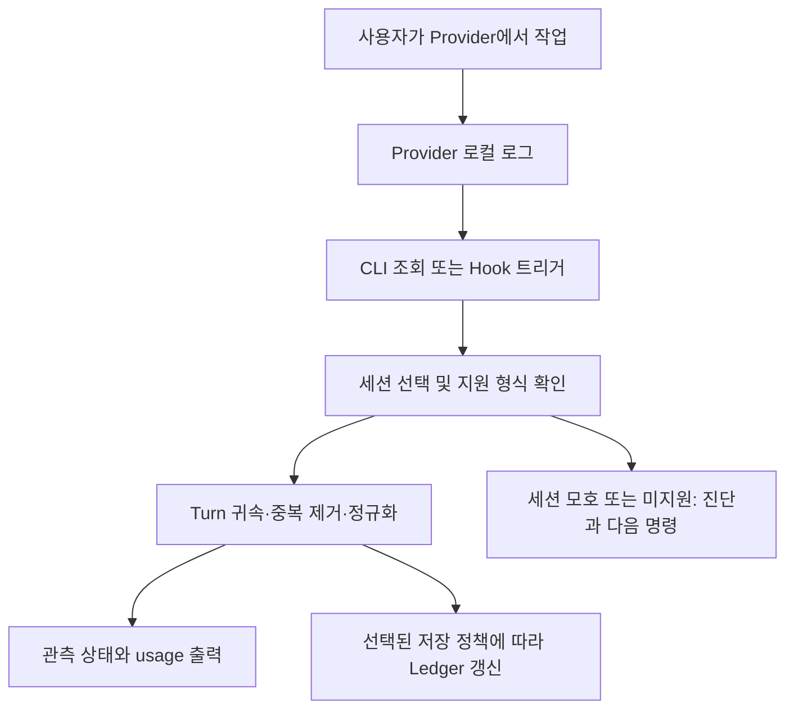

# Design — Task Token Meter 기획

작성일: 2026-09-19 · 상태: 구현 준비안, 사용자 결정 대기

## Overview

Claude Code와 Codex의 로컬 사용 기록에서 사용자 프롬프트 한 번에 해당하는 Turn의 토큰 사용량을 계산하는 CLI 도구다. 계산에 LLM을 호출하지 않고 Provider가 기록한 usage를 사용한다. 첫 제품의 핵심은 Turn Meter이며, 여러 Turn을 의미적으로 묶는 Task Meter는 후속 단계다.

이 문서 묶음은 제품 구현물이 아니다. `architecture.md`는 추천안을 구체화한 조건부 설계이고, `user-confirm.md`의 Pending 항목은 승인된 결정이 아니다. 구현 순서는 `plan.md`를 따른다.

### 분석한 원문 전체

| 자료 | 성격 | 적용 방법 |
|---|---|---|
| [최초 아이디어](../ideas/task-token-meter.md) | Idea v0.1, 확정 원칙과 MVP/Later 구분 | 12절의 결정 사항을 기준으로 유지 |
| [Claude 검토](../ideas/task-token-meter-claude-feedback.md) | 원안에 대한 실측 기반 의견과 변경 제안 | 실측은 해당 버전의 보고이며, 범위 변경은 사용자 결정으로 분리 |

기준 커밋은 `148f7e7d4919f90df1c37dbc1036622e337f5eda`다. 이 작업에서 `docs/ideas/`의 두 문서를 모두 읽었다. 제품 소스, 기존 UI, 대상 저장소 자체의 AGENTS.md/CLAUDE.md는 없었다.

### 확정·제안·충돌 구분

| 항목 | 원안 | 검토 의견 | 준비안에서의 처리 |
|---|---|---|---|
| 실행 주체 | 외부 CLI, LLM 계산 금지 | 동의 | 유지 |
| Provider | Claude Code + Codex | 동의 | 둘 다 MVP 통과 조건 |
| 측정값 | 실제 usage, native 보존 | 동의, 정규화 함정 지적 | 유지, 정규화 계약 구체화 |
| 경계/수집 | Hook 시작·종료로 자동 측정 | 로그 ID 중심, Hook은 재집계 트리거 | UC-001 Pending |
| 저장 위치 | workspace 로컬 우선 검토 | 사용자 전역 추천 | UC-003 Pending |
| 저장 형식 | JSONL 예시, 스키마 미확정 | SQLite 또는 세션별 파일 | UC-004 Pending |
| 서브에이전트 | 범위 미명시 | 포함 필요 | UC-005 Pending |
| 비용 | Later | MVP로 앞당기기 | UC-006 Pending, 승인 전 MVP 확정 아님 |
| 구성 메타데이터 | 장기 비교 목적 | MVP부터 수집 | UC-007 Pending |
| Task | Later, 수동 경계 후보 | 브랜치 기본 그룹 제안 | Deferred, MVP에 넣지 않음 |

## Problem

한 세션에서 A 작업과 B 작업을 연달아 수행하면 세션 누적값만으로 B의 소비량을 알기 어렵다. 동시에 단순한 누적값 차감은 백그라운드 작업, 세션 재개, 로그 중복, 중단 때문에 정확하지 않을 수 있다. 캐시 포함 관계가 다른 Provider를 같은 필드명으로 더하는 것도 잘못된 비교를 만든다.

## Goals

1. 현재 또는 직전 Turn의 관측 가능한 usage와 측정 한계를 확인한다.
2. 동일 원본 재집계 시 토큰 수가 늘지 않는 결정적 집계를 제공한다.
3. Native usage와 정규화 지표를 함께 보존한다.
4. 측정 실패가 AI 개발 작업을 막지 않게 한다.
5. 두 Provider의 차이를 Adapter에 격리한다.

## Non-Goals

- 청구서 대체, 구독 사용 한도 계산, 로그에 없는 usage 추정.
- tokenizer로 실제 usage를 대체하거나 LLM으로 로그·Task를 분석하는 기능.
- MVP의 의미 기반 Task 묶기, 비용 분석, 통계 대시보드, 조직 관리.
- 원격/클라우드 로그 수집, 상시 서버, 외부 텔레메트리 전송.
- 준비 단계에서 제품 코드, Hook 설치, 실제 사용자 로그 수집 수행.

비용 환산의 MVP 승격은 UC-006에서 명시적으로 선택한 경우에만 범위에 들어온다.

## Target Users

장시간 세션을 사용하는 개인 개발자와 Harness 실험 사용자다. 우선 환경은 Windows + PowerShell 5.1이며, 정식 지원 OS·배포 방식은 UC-002에서 정한다. 서브모듈 허브, 여러 worktree, 동일 workspace의 동시 세션을 고려한다.

## Core Concept

- **Session:** Provider가 부여한 실행 세션 식별자.
- **Turn:** 사용자 프롬프트 1회에서 비롯된 실행. 토큰 집계용 root와 실제 실행한 child Turn을 구분한다.
- **Task:** 여러 Turn을 사용자의 목적에 따라 묶는 후속 계층. Turn을 Task로 표기하지 않는다.
- **관측 범위:** 선택한 source에서 실제 usage가 기록된 호출. 로그에 없는 부가 호출은 포함을 보장할 수 없다.
- **Ledger:** 관측 결과와 출처를 보존하는 저장소. 추천안에서는 로그가 남아 있는 기간에 재구축 가능한 파생값이며, 원본 삭제 후에는 보관된 스냅샷이다.

Processsed 같은 범용 합계로 비용 효율을 주장하지 않는다. 기본 화면은 토큰 종류별 내역을 우선하고, `processedTokens`는 포함 관계가 검증된 경우에만 보조 지표로 제공한다.

## User Scenarios

| ID | 시나리오 | 기대 결과 |
|---|---|---|
| S-01 | 한 세션에서 프롬프트 두 개 완료 | 두 Turn을 독립 조회, 세션 누적을 두 번째 Turn으로 오인하지 않음 |
| S-02 | 진행 중 사용량 확인 | 현재까지 관측값과 `running`/`provisional` 표시 |
| S-03 | 서브에이전트가 부모 Stop 이후 완료 | 재조회/재동기화 시 같은 root Turn 수정, 새 Turn으로 이중 생성하지 않음 |
| S-04 | Hook 미설치 또는 누락 | UC-001 추천안에서는 로그 기반 소급 조회 가능 |
| S-05 | 동일 workspace에 세션 두 개 | 자동으로 아무 세션도 고르지 않고 후보 ID 제시 |
| S-06 | 중단·손상·알 수 없는 스키마 | 오류 원인과 부분 관측을 구별, 없는 usage를 0으로 표시하지 않음 |
| S-07 | 원본 로그 정리 이후 | 저장된 시점과 source 누락을 표시, 기존 보관값 유지 |

## User Flow



위 흐름은 UC-001의 로그 중심 추천안이다. Hook 중심안을 선택하면 경계 저장 및 복구 흐름을 별도로 다시 설계한다.

## Features

### 원안의 MVP

두 Provider Adapter, 프롬프트별 측정, native/normalized usage, Claude 중복 제거, Ledger, 현재/직전 Turn CLI, 비차단 Hook이다.

### 사용자 승인에 따라 추가 또는 변경될 항목

- 조회 시 재집계 + Hook을 통한 비동기 보관: UC-001.
- 서브에이전트 포함 및 귀속 실패 표시: UC-005.
- 구성 해시·실험 라벨 보존: UC-007.
- 단가표 비용 추정: UC-006에서 MVP 선택 시만.

### 후속 범위

`task start/end`, 브랜치 기반 그룹 후보, `history`, `stats`, Harness 비교, Dashboard, 조회용 Skill, OTel 보조 수집기. 개발 중 편의상 MVP에 끼워 넣지 않는다.

## Functional Requirements

아래 명령은 제품 계약 제안이며 아직 실행 가능한 명령이 아니다.

| ID | 요구사항 | 인수 조건 |
|---|---|---|
| FR-01 | `token-meter current` | 명시된 session의 최신 root Turn을 상태와 함께 반환; 실행 중 Turn 포함 |
| FR-02 | `token-meter last` | 가장 최근 terminal Turn 반환; terminal 여부가 불명확하면 최신 관측 Turn이라는 경고와 provisional 상태 반환 |
| FR-03 | `token-meter turns --session <id>` | 시간순 Turn 목록과 root/child 관계 조회; 날짜별 통계는 제외 |
| FR-04 | 공통 선택자 | `--provider`, `--session`, `--workspace` 제공; workspace 기본값은 cwd의 가장 가까운 Git root 또는 cwd |
| FR-05 | 자동 선택 | 명시 ID > 검증된 Hook context > workspace의 단일 후보; 여러 후보면 선택 요청 오류 |
| FR-06 | 실제 usage | 알 수 없는 필드·결손은 native와 진단에 남기며 추정값을 실제 usage로 표시하지 않음 |
| FR-07 | 중복 제거 | 반복 레코드/재개 파일/턴 누적 스냅샷을 합산하지 않음 |
| FR-08 | 구조화 조회 | `--json`은 버전 있는 JSON만 stdout 출력; 진단은 stderr, 사람이 읽는 출력과 수치 동일 |
| FR-09 | 보관 | `sync --provider <p> --session <id>`는 명시적 갱신; `rebuild`는 보관값 삭제 없이 존재하는 source만 재검증 |
| FR-10 | Hook | 사용자 명령으로 설치/제거, 기존 설정 보존, 무한 재호출·차단·LLM context 주입 없음 |
| FR-11 | 품질 표시 | execution 상태와 measurement 품질을 분리, `unknown`과 실제 0 구별 |
| FR-12 | 계측 범위 | main/child 포함 정책·누락 파일·미귀속 호출 수 표시; root와 child 중복 합산 방지 |

조회는 UC-001 추천안에서 기본적으로 원본을 읽어 최신 스냅샷을 계산한다. 저장은 `sync`/Hook에서 수행한다. 원본 부재 시 보관값을 반환하되 관측 시점을 명시한다. 설치 편의 alias `tm`는 실행 파일 충돌을 확인하기 전 배포 계약에 넣지 않는다.

### CLI 출력 예시

아래는 실측 결과가 아닌 합성 데이터다. `uncachedInput 1200 + cacheRead 8000 + cacheWrite 300 + output 500 = processed 10000`이다.

```text
> token-meter last --provider claude-code --session demo-session
Turn          demo-turn-02
Execution     completed
Measurement   observed / scope: main + attributed children
Observed at   2026-09-19T02:10:00Z
Fresh input       1,200
Cache read        8,000
Cache write         300  (5m: 300, 1h: 0)
Output              500
Processed        10,000  (not a cost score)
API calls             2
Coverage            N/A  (no comparable independent total)
```

```text
> token-meter current --provider codex --session demo-session
Turn          demo-turn-03
Execution     running
Measurement   partial / observed values can change
Input (total)     1,000
  Cached input      600
  Fresh input       400
Output              200
  Reasoning          50  (included in output)
Processed         1,200
Warning       1 child source is unavailable; root total is incomplete.
```

```text
> token-meter last
Multiple sessions match this workspace. Select one:
  claude-code  demo-session-a
  codex        demo-session-b
Next: token-meter last --provider codex --session demo-session-b
```

## Non-Functional Requirements

以下 수치는 원문 실측의 재현 주장이 아니라 구현 단계에서 검증할 잠정 성능 예산이다.

- 정확성: 합성 fixture의 모든 필드와 귀속 결과가 기대값과 정확히 일치한다.
- 멱등성: 같은 source를 10회 처리해도 usage·논리 레코드 수가 동일하다.
- 성능: 기준 Windows 장비에서 20 MB/100,000행 fixture 조회 p95 1초 이내, peak RSS 256 MB 이내를 목표로 30회 측정한다. CPU·디스크·cold/warm 조건을 기록한다.
- Hook: 프로세스 시작·이벤트 수락 p95 250 ms 목표, 집계는 Provider가 검증된 async 방식으로 실행. timeout·프로세스 시작 실패까지 실제 E2E로 검증한다.
- 내구성: 동시 8개 writer 및 강제 종료 후 저장소 무결성·중복 방지 확인.
- 호환성: PowerShell 5.1, 공백·한글 경로, 리디렉션, `NO_COLOR`, 80열 터미널 지원.
- 개인정보: 대화 본문·툴 인자·시크릿 저장 및 외부 전송 0건.

## Constraints

- JSONL 내부 형식은 영구 공개 API로 간주하지 않는다. 지원 Provider 버전·형식을 기록한다.
- 검토 의견의 Claude Code 2.1.277 / Codex 0.153.4 실측은 이번 실행에서 재측정하지 않았다.
- 로그 ID 존재와 Hook ID 대응은 별개 검증 항목이다. 이름이 비슷하다는 이유로 join하지 않는다.
- 원본 보존 기간이 끝나면 완전한 재구축을 보장할 수 없다.
- 어떤 진단 도구와의 합계 일치도 scope·수집 시점·정규화가 같을 때만 정확성 증거가 된다.

## Edge Cases

1. 마지막 JSONL 행이 쓰기 중이면 다음 조회로 재시도하고 provisional 표시.
2. 중간 손상행은 해당 source의 partial 원인으로 남기고 건너뛴 행 번호·코드만 기록.
3. ID 없는 usage는 별도 미귀속 관측으로 보존; 시간 근접만으로 Turn 생성 금지.
4. 세션 재개·fork는 lineage를 이용하고, fork에 복사된 이전 usage를 새 소비로 계산하지 않음.
5. 다른 workspace에서 생성된 child는 명시적 parent 관계가 있을 때만 root에 귀속.
6. 모델 변경은 호출별로 유지, 한 Turn에 모델 하나를 강제로 부여하지 않음.
7. 로그 truncate·삭제·권한 거부로 빈 결과가 나와도 기존 Ledger를 0으로 덮어쓰지 않음.
8. 과거 턴을 재집계하면서 현재 git HEAD나 설정을 과거 환경으로 저장하지 않음.

## Success Criteria

- FR-01~12가 확정된 범위에서 통과하고 두 Provider가 모두 동작한다.
- 중복·부분 스트리밍·child 지연·중단·재개·모델 변경을 포함하는 fixture가 통과한다.
- 동일 scope의 참조 집계와 차이를 필드별로 설명한다. 설명 없는 차이는 정확성 통과로 처리하지 않는다.
- Hook 누락·실패 상황에서도 Provider 작업이 계속되며 명시적 재동기화로 복구한다.
- 사용자는 실제 0, 관측 불가, 아직 변경 가능 상태를 CLI만으로 구분한다.
- Pending 결정은 영향을 받는 구현 작업의 시작 전에 기록되고 관련 문서가 갱신된다.
