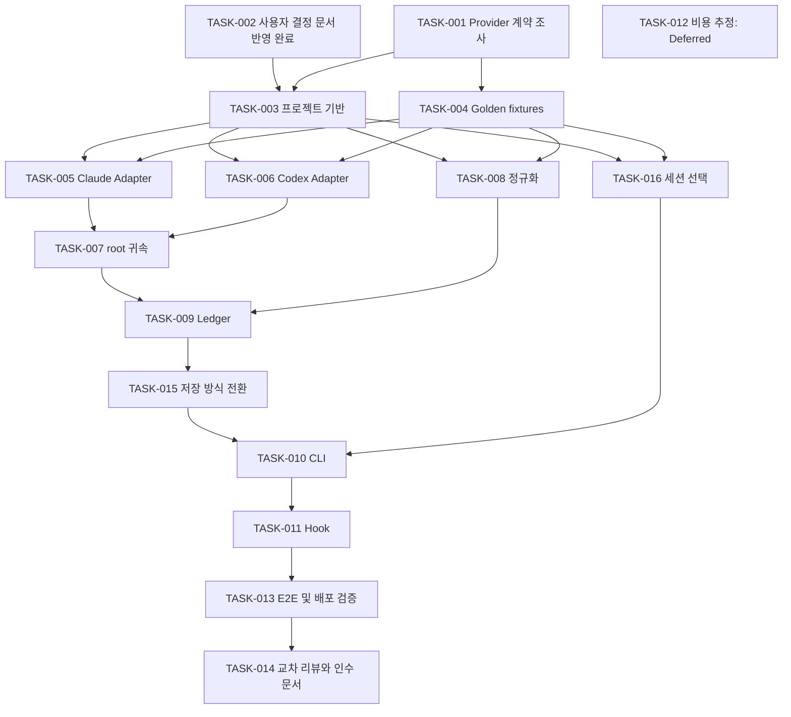

# Plan — 구현 작업 계획

작성일: 2026-09-19 · 갱신일: 2026-09-20 · 상태: 사용자 결정 반영 완료, 제품 구현 미착수

## 계획의 기준

[design.md](design.md), [architecture.md](architecture.md), [user-confirm.md](user-confirm.md)를 반영해 이 계획을 마지막으로 갱신했다. 아이디어 기준은 `148f7e7`, 사용자 결정 기준은 `2498359`다. UC-001~008 선택은 A, A, C, A, A, A, A, C이며 사용자 결정 차단은 모두 해소되었다.

- TASK-002의 문서 동기화만 이번에 완료했다. TASK-001의 실측·계약 조사와 제품 코드는 아직 실행하지 않았다.
- 기술적 미확인 사항은 사용자 선택과 구분한다. Parser 지원 여부는 TASK-001의 근거와 TASK-004의 fixture로 검증한다.
- C#/.NET Windows CLI, global/workspace SQLite, child 포함, 다중 세션 대화형 선택이 MVP다. 비용 추정 TASK-012는 Deferred다.
- TASK-015(저장 방식 전환)와 TASK-016(터미널 세션 선택)을 추가하여 두 C 선택의 구현 범위를 분리했다.
- Blocked By에는 미해결 기술 선행 관계를 적고, 확정된 UC는 차단으로 남기지 않는다.
- 실제 개인 로그는 승인된 범위에서 구조/수치만 조사하고 합성 fixture를 기본으로 한다. 이번 스킬은 구현 준비 문서까지 수행한다.

## UI 필요 여부와 시안 생략

MVP의 사용자 인터페이스는 터미널 CLI다. 다중 세션은 번호 입력 CLI로 선택하며, 전체 화면 TUI·웹·데스크톱 그래픽 화면은 없고 원안은 Dashboard를 Later로 분류한다. 따라서 그래픽 UI 비교용 `samples/sample1~3`을 만들지 않는다. 조회 완료/진행 중/세션 모호성의 CLI 출력 예시는 design.md에 있고, JSON·무색 출력·80열·리디렉션을 TASK-010/016에서 검증한다.

`taste`/`impeccable`에 따른 화면 시안 생성은 그래픽 UI가 범위에 들어올 때 수행한다. 이번에는 관련 스킬을 참고했지만 웹 UI 생성 절차는 적용하지 않았다. 장식용 웹 시안을 만들기 위해 제품 범위를 늘리지 않는다.

## 작업 모델 선택

사용자 요청에 따라 모델 배정은 `gpt-5.6-sol`, `gpt-5.6-terra`, `gpt-5.6-luna`로 구성한다. 기존 상위 모델 배정 작업인 TASK-001/002/007/014는 `gpt-5.6-sol`로 변경하며 추론 수준은 High를 유지한다. 조사·귀속·리뷰 작업은 명시된 근거와 fixture 검증을 충족해야 한다. 호출 가능한 Claude 모델은 이 세션에 노출되지 않았으므로 실행을 약속하지 않는다.

여기의 모델 지정은 후속 실행을 위한 계획이며, 이번 준비 작업에 해당 모델의 서브에이전트를 실행했다는 뜻이 아니다. 추론 수준은 이 스킬의 `Low / Medium / High / Extra High` 표기를 쓴다. 2026-09-20 모델 배정 변경은 이후 실행·재실행에 적용한다. 이미 Completed인 TASK-002의 실제 실행 모델을 소급해서 변경했다는 뜻이 아니다.

## 실행 순서와 병렬화

003 이후 005/006/008은 Core 계약이 고정됐을 때 서로 다른 파일을 맡겨 병렬화할 수 있다. 016은 Core 계약 고정 후 Adapter 작업과 병렬화할 수 있다. 012는 후속 범위이므로 MVP 병렬 작업에 배정하지 않는다. Core 계약·schema·동일 브랜치의 Git 상태를 동시에 수정하지 않는다. 실제 위임 여부는 당시 도구·모델 가용성과 토큰 비용을 보고 결정한다.

## TASK-001 — Provider 계약과 관측 한계 조사

### Goal
아이디어의 실측 보고를 구현 가능한 버전별 계약과 반례 목록으로 바꾼다.
### Dependencies
없음. docs/ideas 두 문서 전체와 architecture의 불확실성 목록을 읽는다.
### Blocked By
없음. 개인 로그 접근이 미승인인 경우 공개 공식 문서와 합성 자료로 먼저 진행하고 실측 항목은 미검증으로 남긴다.
### Scope
- 현재 공식 Hook 문서와 설치 대상 버전 대조. prompt_id/promptId, turn_id/root_turn_id, root session lineage 확인.
- Claude request/message alias, snapshot 최댓값·모순 사례, 재개/fork·task-notification 귀속 규칙 확인.
- Codex call delta/turn snapshot/session snapshot 분류와 root main-only/child-inclusive 구분.
- nonzero cache write, total-only, 누락 ID, Esc·늦은 child·Hook stdout 계약 검증 방법 정리.
- session-report/ccusage 버전·라이선스·scope 차이를 기록. API 호출 없이 수행 가능한 증거를 우선한다.
### Files
`docs/research/provider-contracts.md`, `docs/research/source-matrix.md`.
### Validation
각 주장에 Provider 버전·근거·확인/미확인 상태와 재현 절차가 있다. ID와 snapshot 의미가 확인되지 않은 형식은 unsupported로 분류한다. 민감 원문이 산출물에 없다.
### Agent
Codex
### Model
gpt-5.6-sol
### Reasoning Level
High
### Reason
Provider별 조사 범위와 검증 항목이 정의되어 있어 Sol에 High 추론으로 배정한다. 계측 의미와 예외는 근거·반례로 확인하며 대규모 로그 전체를 모델 context에 넣지 않는다.

## TASK-002 — 사용자 결정 반영과 준비 문서 동기화

### Status
Completed — 2026-09-20. 문서 동기화 완료이며 Provider 계약 실측 완료를 뜻하지 않는다.
### Goal
사용자 선택을 기획·설계·계획에 반영하고 미해결 기술 검증을 구별한다.
### Dependencies
사용자 결정 커밋 `2498359`. TASK-001은 후속 기술 검증이며 이 문서 동기화를 차단하지 않는다.
### Blocked By
없음. UC-001~008 모두 Confirmed.
### Scope
UC-003=C의 두 저장 방식과 migration, UC-008=C의 대화형/비대화형 선택, UC-006=A의 비용 Deferred를 반영한다. 기존 선택 원문을 유지한다. Provider schema의 미검증 의미를 승인된 사실로 바꾸지 않는다.
### Files
`docs/prepare/design.md`, `architecture.md`, `user-confirm.md`, `plan.md`.
### Validation
확정 선택과 현재 요구사항·CLI 예시가 일치한다. TASK-015/016을 포함한 의존 그래프에 순환이 없고 비용 작업이 MVP를 차단하지 않는다. 모든 User Decision 원문이 유지된다.
### Agent
Codex
### Model
gpt-5.6-sol
### Reasoning Level
High
### Reason
확정된 사용자 선택을 문서에 반영하는 작업으로 Sol을 배정한다. High 추론으로 선택 원문과 문서 간 의존 관계를 대조한다.

## TASK-003 — 빌드 가능한 CLI 프로젝트와 계약 타입

### Goal
선택된 runtime에서 Core/Adapter/Storage/CLI를 독립 검증할 기반을 만든다.
### Dependencies
TASK-001, TASK-002.
### Blocked By
사용자 결정 차단 없음. 위 Dependencies의 미완료 작업을 먼저 완료한다.
### Scope
정식 solution/project, SDK·패키지 lock, nullable·checked token 연산, interface/DTO(StorageRoute·InteractionMode 포함), 테스트 프로젝트, 최소 CI build/test를 만든다. 실제 provider parser나 임시 전역 Hook을 넣지 않는다.
### Files
`TaskTokenMeter.sln`, `global.json`, `Directory.Build.props`, `src/*/*.csproj`, `src/TaskTokenMeter.Core/Contracts/`, `tests/*/*.csproj`, `.github/workflows/ci.yml`.
### Validation
clean checkout에서 restore/build/test 명령이 성공한다. Core가 CLI·Provider 설치에 의존하지 않는다. JSON에 schemaVersion 및 nullable 수치가 유지된다.
### Agent
Codex
### Model
gpt-5.6-luna
### Reasoning Level
Medium
### Reason
고정된 계약의 프로젝트·타입 생성 중심이라 저비용 모델로 충분하다.

## TASK-004 — 합성 Golden fixture와 oracle 정의

### Goal
실제 개인정보 없이 정답이 계산된 Provider별·공통 반례 묶음을 만든다.
### Dependencies
TASK-001.
### Blocked By
없음. Provider의 미확인 usage 의미는 반례로 명시하며 사용자 scope 선택과 혼동하지 않는다.
### Scope
2턴, streaming duplicate, alias 혼재, total-only, root inclusive/main-only, 늦은 child, fork 복제, partial tail, 손상행, model change, 누락 identity를 최소 JSONL로 작성한다. 기대 native/normalized usage·귀속·quality를 손계산하고 fixture별 출처/합성 여부를 적는다.
### Files
`tests/fixtures/claude/`, `tests/fixtures/codex/`, `tests/fixtures/expected/`, `tests/fixtures/README.md`.
### Validation
모든 fixture에 독립적인 기대값과 목적이 있고 원문 대화/키/실제 경로가 없다. 정상 0·unknown·invalid를 구분하는 반례가 있다. 단순 구현 복사 테스트가 아니다.
### Agent
Codex
### Model
gpt-5.6-sol
### Reasoning Level
High
### Reason
정답 fixture가 정확성의 기준이므로 경계 조건과 수치 관계를 충분히 검토한다.

## TASK-005 — Claude 로그 Adapter

### Goal
Claude 지원 버전의 관측을 중복 없는 호출과 턴 후보로 변환한다.
### Dependencies
TASK-003, TASK-004.
### Blocked By
사용자 결정 차단 없음. 위 Dependencies의 미완료 작업을 먼저 완료한다.
### Scope
source snapshot 읽기, UUID 중복 제거, request/message alias와 compatible revision 선택, promptId·parent metadata 추출, TTL breakdown, 지원 형식 판별을 구현한다. 다른 호출의 필드별 max를 합치지 않는다.
### Files
`src/TaskTokenMeter.Adapters/Claude/`, `tests/TaskTokenMeter.UnitTests/ClaudeAdapterTests.cs`.
### Validation
9→9→338은 output 338 한 번이다. 파일 순서를 바꿔도 정답이 같으며 alias 누락·충돌·재개·tail fixture가 통과한다. 원본 본문이 출력/저장 DTO에 없다.
### Agent
Codex
### Model
gpt-5.6-sol
### Reasoning Level
High
### Reason
계약은 고정됐지만 identity와 streaming의 예외 구현에 높은 주의가 필요하다.

## TASK-006 — Codex usage Adapter

### Goal
검증된 Codex usage authority와 root 관계를 보존한다.
### Dependencies
TASK-003, TASK-004.
### Blocked By
사용자 결정 차단 없음. 위 Dependencies의 미완료 작업을 먼저 완료한다.
### Scope
지원 rollout/record 버전 판별, usageKind 분류, 누적 snapshot 교체, delta의 검증 전용 사용, lineage 추출, total-only/nonzero cache-write 보존을 구현한다. 구형 session-only 형식을 임의 Turn 차감으로 대체하지 않는다.
### Files
`src/TaskTokenMeter.Adapters/Codex/`, `tests/TaskTokenMeter.UnitTests/CodexAdapterTests.cs`.
### Validation
100→250 snapshot과 대응 delta를 함께 읽어도 250이다. child-inclusive/main-only capability가 구별되고 unknown scope는 partial이다. unsupported 입력이 정상 0건 성공이 되지 않는다.
### Agent
Codex
### Model
gpt-5.6-sol
### Reasoning Level
High
### Reason
누적값과 증분값 혼동을 피하면서 검증된 schema를 구현하는 작업이다.

## TASK-007 — 공통 identity, root 귀속, 상태 projection

### Goal
두 Adapter의 실행을 root Turn에 정확히 한 번 귀속한다.
### Dependencies
TASK-005, TASK-006.
### Blocked By
사용자 결정 차단 없음. 위 Dependencies의 미완료 작업을 먼저 완료한다.
### Scope
root session lineage, Membership, 미귀속 observation, source completeness, execution/measurement 상태 분리, 늦은 child 갱신, 재개/fork origin identity를 구현한다.
### Files
`src/TaskTokenMeter.Core/Identity/`, `Attribution/`, `Projection/`, `tests/TaskTokenMeter.UnitTests/AttributionTests.cs`.
### Validation
root 상세와 child 상세를 함께 조회해도 고유 실행 합계가 중복되지 않는다. 부모가 불명확하면 임의 귀속되지 않는다. completed root에 child가 늦게 추가되어도 root key가 유지된다.
### Agent
Codex
### Model
gpt-5.6-sol
### Reasoning Level
High
### Reason
선행 Adapter 계약과 fixture를 바탕으로 Sol이 귀속 로직을 구현한다. High 추론을 유지하고 root/child 중복·미귀속·늦은 갱신의 인수 기준으로 정확성을 검증한다.

## TASK-008 — 정규화와 품질 지표

### Goal
명시된 포함 관계로 안전하게 토큰 지표를 계산한다.
### Dependencies
TASK-003, TASK-004.
### Blocked By
사용자 결정 차단 없음. 위 Dependencies의 미완료 작업을 먼저 완료한다.
### Scope
native 보존, null propagation, knownSubtotal, TTL breakdown 검증, Codex cached/reasoning 부분집합, checked 합계, maxObservedInput·apiCallCount 산출 조건, coverage N/A 조건을 구현한다.
### Files
`src/TaskTokenMeter.Core/Usage/`, `tests/TaskTokenMeter.UnitTests/UsageNormalizationTests.cs`.
### Validation
Codex 1000/600/200/50에서 fresh 400·processed 1200이다. Claude total과 TTL을 중복 합산하지 않는다. 순열·중복 불변성, overflow, null·negative·invalid, coverage 분모 부재/0 테스트 통과.
### Agent
Codex
### Model
gpt-5.6-terra
### Reasoning Level
High
### Reason
정해진 수식 구현이지만 unknown과 포함 관계를 검증하는 테스트가 중요하다.

## TASK-009 — Ledger와 재동기화 내구성

### Goal
동시 수집과 원본 손실에도 기존 정상 결과를 보존한다.
### Dependencies
TASK-003, TASK-004, TASK-007, TASK-008.
### Blocked By
사용자 결정 차단 없음. 위 Dependencies의 미완료 작업을 먼저 완료한다.
### Scope
global/workspace 두 모드의 SQLite와 workspace별 활성 route, unique key·transaction·schemaVersion·migration, expectedRevision/source generation 비교, missing-source 보존, 명시적 purge와 진단 보관 제한을 구현한다. mode와 독립된 workspaceId, 단일 활성 writer, route generation 검사를 공통 계약으로 제공하고 migration은 TASK-015에서 구현한다. network filesystem 지원을 임의로 넓히지 않는다.
### Files
`src/TaskTokenMeter.Storage/`, `tests/TaskTokenMeter.IntegrationTests/LedgerTests.cs`, `docs/storage.md`.
### Validation
두 저장 모드 각각에서 동시 8 writer·같은 snapshot 10회·역순 완료·강제 종료·디스크 쓰기 실패·migration 실패에서 일관성을 유지한다. truncate/권한 거부가 기존 정상값을 0으로 덮어쓰지 않는다.
### Agent
Codex
### Model
gpt-5.6-sol
### Reasoning Level
High
### Reason
transaction과 crash 복구는 반복 코드보다 상태 전이 검증의 비중이 크다.

## TASK-010 — CLI 조회와 사용성

### Goal
사용자가 세션·측정 범위·품질을 혼동하지 않고 조회한다.
### Dependencies
TASK-007, TASK-008, TASK-009, TASK-015, TASK-016.
### Blocked By
사용자 결정 차단 없음. 위 Dependencies의 미완료 작업을 먼저 완료한다.
### Scope
current/last/turns/sync/rebuild, workspace 탐색, TASK-016 selector 연결, storage status/migrate 명령 연결, JSON·text renderer, --strict·exit code, fresh/stale 표시, 최소 help와 개인정보 설정을 구현한다. history/stats/task grouping은 제외한다.
### Files
`src/TaskTokenMeter.Cli/`, `tests/TaskTokenMeter.IntegrationTests/CliTests.cs`, `docs/cli.md`.
### Validation
design의 완료·진행 중·대화형 선택·비대화형 오류·저장 전환 시나리오, empty/partial/unsupported/ambiguous 상태가 실행된다. text와 JSON 수치가 같고 JSON stdout은 parse 가능하다. 80열, 한글/공백 경로, NO_COLOR, PowerShell 5.1 리디렉션을 확인한다.
### Agent
Codex
### Model
gpt-5.6-terra
### Reasoning Level
Medium
### Reason
확정된 인터페이스와 정규화 결과를 연결하는 범위가 명확한 구현이다.

## TASK-011 — Provider별 비차단 Hook 설치와 복구

### Goal
사용자가 명시적으로 활성화했을 때 자동 보관을 제공한다.
### Dependencies
TASK-009, TASK-010.
### Blocked By
사용자 결정 차단 없음. 위 Dependencies의 미완료 작업을 먼저 완료한다.
### Scope
실제 지원 버전별 Stop/SubagentStop/Interrupt 등 필요한 command Hook만 연결한다. event neutral response·async·timeout·path validation, 기존 설정 병합·backup·제거, 실시간 context provenance를 구현한다. registry의 활성 저장 모드를 사용하고 Hook context를 명시적 세션 선택으로 처리한다. migration과 경합한 commit은 route generation으로 재확인한다. 이름이 비슷하다고 Provider Hook 설정을 공유하지 않는다.
### Files
`src/TaskTokenMeter.Cli/Hooks/`, `packaging/hooks/`, `tests/TaskTokenMeter.IntegrationTests/HookTests.cs`, `docs/hooks.md`.
### Validation
테스트용 Provider 환경에서 성공·에러·timeout·중단·실행 파일 누락에도 사용자 작업이 계속된다. Codex Stop stdout 계약을 지킨다. 설치/제거 후 기존 unrelated Hook이 동일하며 모델 추가 호출·context 주입이 없다. 실제 사용자 설정은 검증용 fixture로 대체한다.
### Agent
Codex
### Model
gpt-5.6-sol
### Reasoning Level
High
### Reason
Provider별 종료/출력 계약과 설정 보존을 함께 검증해야 한다.

## TASK-012 — 로컬 비용 추정 (Deferred)

### Status
Deferred — UC-006=A. MVP 실행·출시 의존에서 제외한다.

### Goal
후속 비용 기능이 별도로 요청되면 모델·TTL별 추정 비용을 설계·구현한다.
### Dependencies
TASK-007, TASK-008, TASK-010.
### Blocked By
후속 범위 요청 전 실행하지 않는다. 현재 UC-006은 Pending이 아닌 Confirmed A다.
### Scope
버전·통화·유효일·모델별 단가표, call 단위 계산, unknown pricing/TTL의 N/A, 알려진 부분합, 출처와 추정임을 표시한다. 과거 호출에 오늘의 가격을 무조건 적용하지 않는다.
### Files
`src/TaskTokenMeter.Core/Pricing/`, `tests/TaskTokenMeter.UnitTests/PricingTests.cs`, `docs/pricing.md`.
### Validation
혼합 모델·TTL·가격 공백·알 수 없는 모델·reasoning 부분집합 fixture 통과. Processed에 단일 단가를 곱하지 않는다. 공식 가격 출처와 확인일을 기록하고 실제 billing과 동일하다고 주장하지 않는다.
### Agent
Codex
### Model
gpt-5.6-terra
### Reasoning Level
Medium
### Reason
범위가 선택된 뒤에는 표와 수식 중심이므로 중간 추론 수준이 적합하다.

## TASK-013 — 전체 흐름·성능·배포 검증

### Goal
두 Provider의 지원 범위와 배포 가능한 품질을 증거로 확인한다.
### Dependencies
TASK-010, TASK-011, TASK-015, TASK-016. TASK-012는 Deferred이므로 의존하지 않는다.
### Blocked By
사용자 결정 차단 없음. 위 Dependencies의 미완료 작업을 먼저 완료한다.
### Scope
합성 E2E와 승인된 실환경 smoke, 동일 scope 참조 비교, 성능 30회 측정, 8 writer, 양방향 migration·crash recovery·TTY/CI/파이프 선택 행렬, 깨끗한 Windows 설치·runtime 부재·native dependency 검증, support matrix를 작성한다.
### Files
`tests/TaskTokenMeter.IntegrationTests/EndToEndTests.cs`, `packaging/`, `docs/validation/acceptance.md`, `docs/validation/performance.md`.
### Validation
FR-01~14와 design Success Criteria에 pass/fail/evidence를 연결한다. 20 MB/100,000행 p95·RSS와 Hook 수락 시간을 실제 측정한다. 기준 미달이면 원인과 수정 작업을 열고 합격 처리하지 않는다. 두 Provider 중 하나 미검증이면 전체 지원 완료라 하지 않는다.
### Agent
Codex
### Model
gpt-5.6-sol
### Reasoning Level
High
### Reason
관측 scope·환경·계측 비용을 종합하는 검증이며 단일 unit test로 대체할 수 없다.

## TASK-014 — 교차 리뷰와 구현 인수 문서

### Goal
정확성·개인정보·비차단 동작을 독립적으로 검토하고 다음 유지보수자가 재현할 수 있게 한다.
### Dependencies
TASK-013. TASK-012는 UC-006=A에 따른 Deferred이며 인수 게이트가 아니다.
### Blocked By
미완료 TASK-013 및 Critical/High 리뷰 이슈. 사용자 결정 차단 없음.
### Scope
구현 diff, scope claim, dedup/null/lineage, 저장 회복·설정 보존, 민감 데이터 경로를 리뷰한다. 설치·제거·조회·지원 버전·측정 한계·복구 절차를 README에 작성한다. 가능하면 구현과 다른 에이전트 세션에서 리뷰한다.
### Files
`README.md`, `docs/validation/review.md`, `docs/validation/acceptance.md`, `docs/prepare/plan.md`의 완료 기록.
### Validation
Critical/High 미해결 이슈가 없고 문서 명령이 배포 산출물에서 재현된다. 사용자 결정·지원 범위·검증 결과가 일치한다. 사용자 요청 없는 push·publish·실사용 Hook 설치는 하지 않는다.
### Agent
Codex
### Model
gpt-5.6-sol
### Reasoning Level
High
### Reason
Sol의 별도 리뷰 세션에 High 추론으로 배정한다. 구현 결과의 정확성·개인정보·복구 동작을 증거와 대조하며 기존 Critical/High 이슈 처리 기준을 유지한다.

## TASK-015 — 저장 모드 전환과 복구

### Goal
UC-003=C의 global/workspace 저장 간 전환을 데이터 손실·중복 없이 제공한다.
### Dependencies
TASK-009.
### Blocked By
사용자 결정 차단 없음. TASK-009의 route·ledger 계약 완료 필요.
### Scope
storage status/migrate/dry-run 서비스, workspace lock, backup·migration journal, 목적지 검증, route atomic switch, superseded source 유지, 충돌 탐지와 재시도를 구현한다. root/child identity를 보존하고 다른 workspace의 기록을 덮어쓰지 않는다. workspace Git exclude를 기존 항목 보존 방식으로 적용한다.
### Files
`src/TaskTokenMeter.Storage/Routing/`, `Migration/`, `tests/TaskTokenMeter.IntegrationTests/StorageMigrationTests.cs`, `docs/storage.md`.
### Validation
global→workspace→global 왕복 후 동일 usage·quality·membership을 유지한다. 중간에 usage가 추가되고 원본 로그가 정리된 경우에도 검증된 superseded lineage로 복귀한다. 다른 workspace의 동시 registry 변경을 보존한다. 같은 migration 재시도·서로 다른 destination 데이터·각 commit 경계의 crash·늦은 Hook writer·readonly destination·disk full·Git exclude 실패를 검증한다. 오류 시 기존 활성 route 유지, 자동 fallback·자동 source 삭제 없음.
### Agent
Codex
### Model
gpt-5.6-sol
### Reasoning Level
High
### Reason
두 저장소와 설정 파일 사이의 원자성을 가정할 수 없어 복구 단계와 경합 검증이 필요하다.

## TASK-016 — 대화형 세션 선택과 비대화형 계약

### Goal
UC-008=C에 맞게 터미널에서 세션을 고르고 자동 실행에서는 입력을 기다리지 않게 한다.
### Dependencies
TASK-003, TASK-004.
### Blocked By
사용자 결정 차단 없음. Core selector·fixture 계약 완료 필요.
### Scope
번호 기반 selector, 후보 표시·제어 문자 제거, 입력 검증·재입력·q/Ctrl+C/EOF 취소, 선택 후 재검증, 명시 ID 우선, 단일 후보 자동 조회를 구현한다. --json/CI/리디렉션/--non-interactive는 provider+session 선택자를 요구하고 Hook은 검증된 context를 사용한다. 전체 화면 TUI는 만들지 않는다.
### Files
`src/TaskTokenMeter.Cli/Selection/`, `tests/TaskTokenMeter.UnitTests/SessionSelectorTests.cs`, `tests/TaskTokenMeter.IntegrationTests/TerminalSelectionTests.cs`.
### Validation
대화형 0/1/N 후보·잘못된 번호·빈 입력·취소·사라진 후보를 재현한다. JSON/CI/stdin 또는 stdout pipe에서는 후보가 하나여도 선택자 누락 시 code 4를 즉시 반환한다. JSON stdout 오염과 Hook의 prompt 호출이 없고 취소 시 write 없이 code 130이다.
### Agent
Codex
### Model
gpt-5.6-terra
### Reasoning Level
Medium
### Reason
확정된 CLI 흐름의 구현이며 대화형·비대화형 분기와 입출력 검증이 중심이다.

## 준비 작업의 완료 점검

| 항목 | 상태 |
|---|---|
| docs/ideas 전체 두 문서 분석 | 완료 |
| design / architecture / user-confirm 작성 | 완료 |
| 그래픽 UI 필요 여부 판단 | 불필요, CLI 예시 포함 |
| plan을 마지막에 작성 | 완료 |
| 모든 TASK에 Agent / Model / Reasoning Level / Reason | 명시 |
| 사용자 선택과 Blocked By 갱신 | UC-001~008 반영, 사용자 차단 없음 |
| 저장 전환·대화형 선택 작업 | TASK-015/016 추가 |
| 비용 작업 | TASK-012 Deferred, MVP 의존에서 제외 |
| 제품 구현·실제 Hook 설치 | 수행하지 않음 |
| 실제 Provider 로그 정확성·성능 검증 | 구현 계획에 포함, 이번 준비에서 수행하지 않음 |

사용자 결정 반영과 준비 문서 동기화는 완료했다. 제품 정확성 검증은 아직 수행하지 않았다. 다음 작업은 TASK-001의 Provider 계약 조사이며 이후 fixture·프로젝트·Adapter 구현으로 진행한다. TASK-002만 Completed이고 TASK-012는 Deferred, 나머지는 미착수다.

## 문서 검증 기록 — 2026-09-20

필수 문서 4개, 내부 링크, 16개 TASK의 필수 필드·모델·추론 수준, 작업 의존 그래프, UC 선택 원문 보존을 점검해 통과했다. 의존 그래프에 순환이 없으며 Deferred 비용 작업을 MVP가 참조하지 않는다. `git diff --check`와 원본 ideas 무변경도 확인했다. 사용자 결정 커밋에서 변경된 파일은 docs/prepare/의 문서뿐이며 원본 ideas는 보존한다. 이 기록은 제품 빌드·실제 로그 측정·Hook 실행을 통과했다는 뜻이 아니다.
